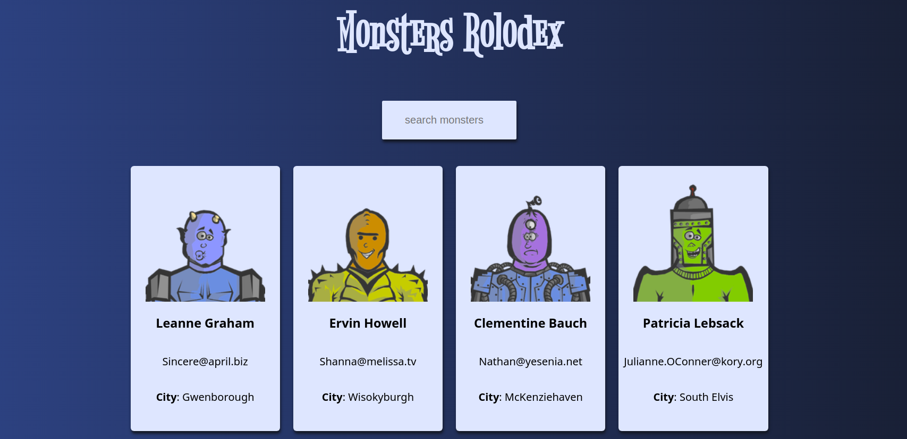

<h1 align="center">
   
  Monsters Rolodex
</h1>

 Monsters Rolodex - Application made with React to list and search for some monsters 

  

## Demo

<a href="https://croberttdmello.github.io/monsters-rolodex/" target="_blank">MONSTERS ROLODEX DEMO</a>
[Reference Link With New Tab](https://github.com/fire1ce/3os.org/ "Opens new tab for reference link"){target=_blank}
[MONSTERS ROLODEX DEMO](https://croberttdmello.github.io/monsters-rolodex)
## 
   
 

## Features

   React
 

## Getting Started

1 - Clone the project with <b>git clone git@github.com:croberttdmello/monsters-rolodex.git</b>

2 - Install the dependences with <b>"npm install"</b>

3 - Run the project with <b>"npm start"</b>

## License

This project is licensed under the MIT License - see the [LICENSE](https://opensource.org/licenses/MIT) page for details.

